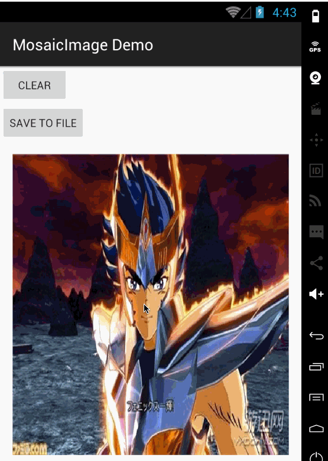

# MosaicImage

Make image mosaic for Android

# Screenshot



# Setup

* In your `build.gradle` :

```gradle
repositories {
    maven { url "https://jitpack.io" }
}

dependencies {
    compile 'com.github.nanjingboy:MosaicImage:1.0.1'
}
```

* [Sample](sample/src/main)


# API

*  `public MosaicView setMosaicAreaSize(int mosaicAreaSize)`
*  `public MosaicView scaleType(int scaleType)`
*  `public MosaicView placeholder(int resId)`
*  `public void load(final String url)`
*  `public void reset()`
*  `public Observable<String> saveToFile()`
*  `public Observable<String> saveToFile(final String filePath)`

# License

MIT